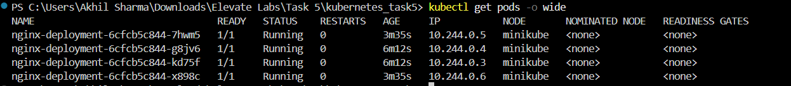
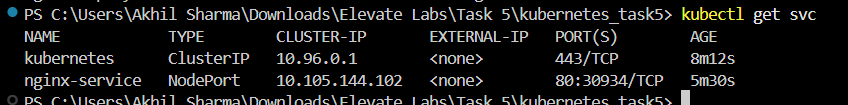
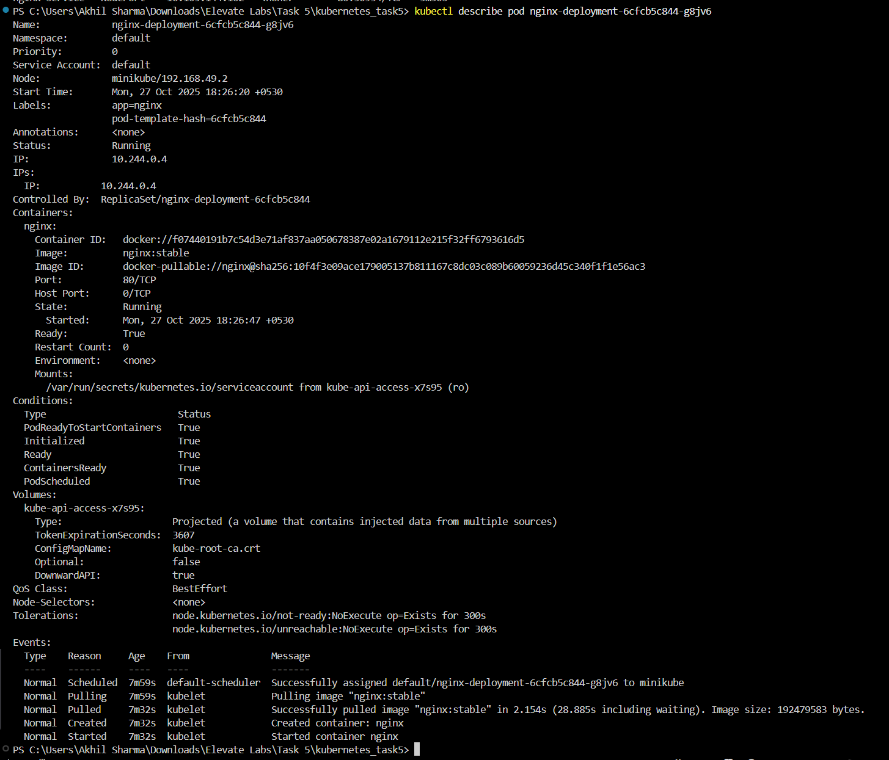
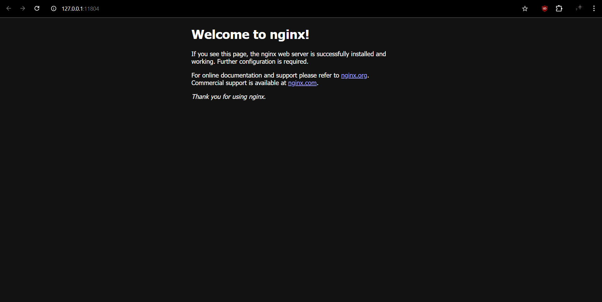

# Build a Kubernetes Cluster Locally with Minikube

## Objective
Deploy and manage apps in Kubernetes.

---
## Steps
1) Established Minikube using Docker Driver.

```bash
minikube start --driver=docker --memory=4096 --cpus=2
```
2) Created manifest files: `deployment.yaml` and `service.yaml`
3) Applied configuration to manifests using:

```bash
kubectl apply -f deployment.yaml
kubectl apply -f service.yaml
```
4) Checked if all pods and services are running:

```bash
kubectl get pods -o wide 
kubectl get svc
kubectl get deployments # Lists deployments
```

5) Scaled the `nginx-deployment` using:

```bash
kubectl scale deployment nginx-deployment --replicas=4
```

6) To open `nginx-service` in the browser:
```bash
minikube service nginx-service --url
```

The default static NGINX webpage is accessible at `http://127.0.0.1:11804`

---
## Screenshots





---